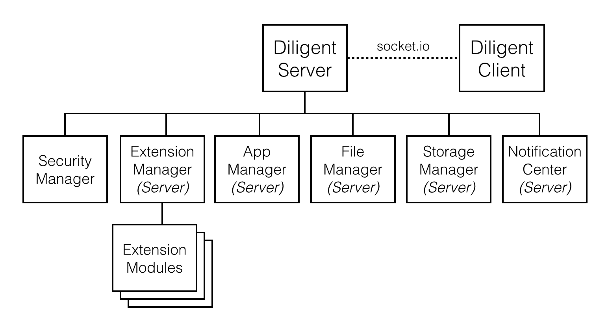
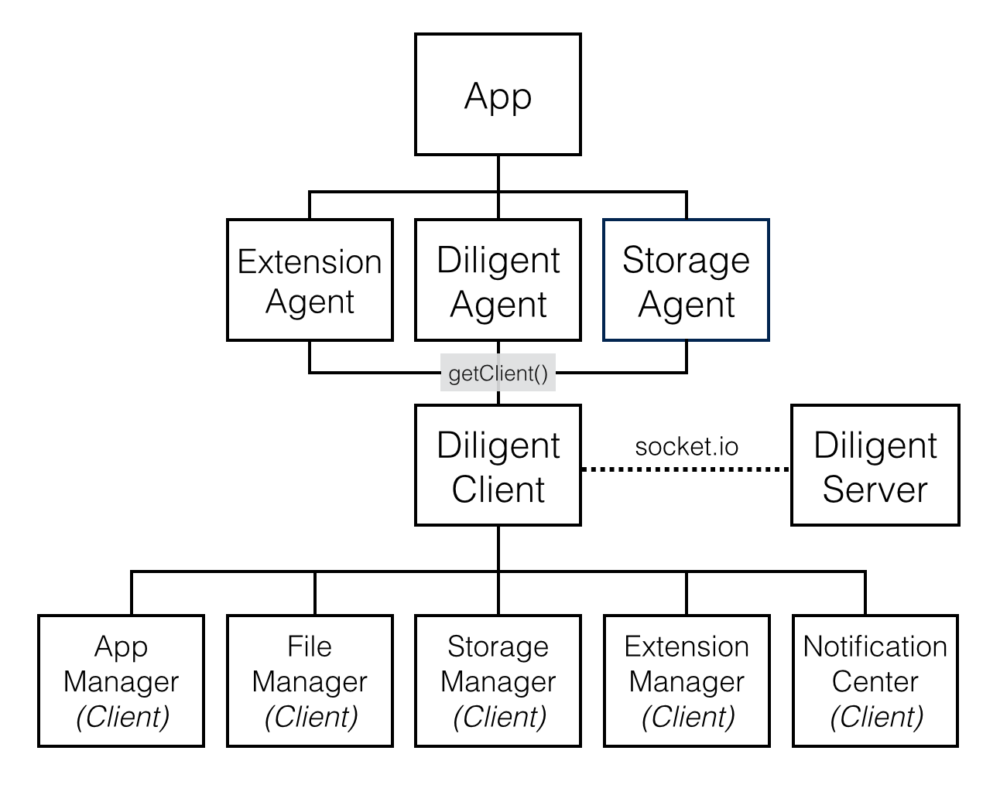
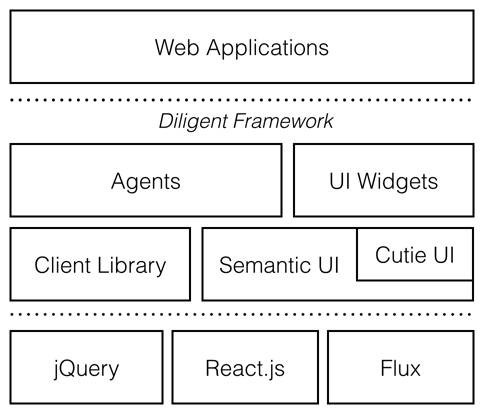
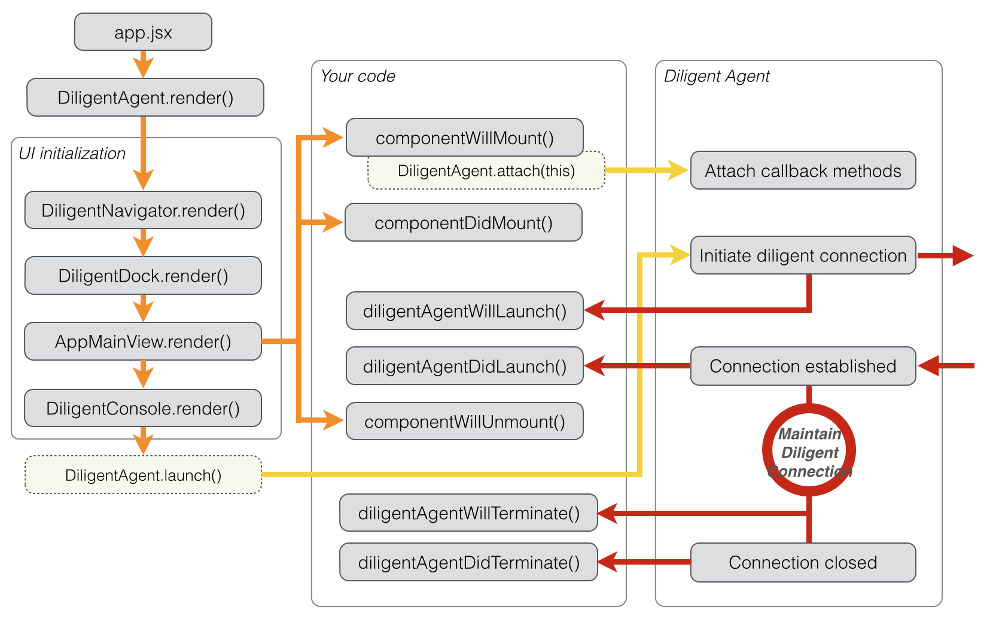

# *wife.io* #

`wife.io` is an extensible web operating system designed for devices which are providing specific services to a small group of users, such as SmartHome Controller, NAS, Media  Center in Car, Factory Management...etc.

## Quick Start ##

1. `$ npm install`
2. [Choose a device](#user-content-device-support)
2. [Configure server settings](#user-content-wife-server-configuration)
3. `$ gulp`
4. `$ node mywife/index.js`
5. Go http://localhost:8001 and enjoy your wife

## Device Support ##

You can find the device support list:
```
$ gulp distclean (for not the first time building the system)
$ gulp
```
You should see a device support list like below:
```
Device Support List
------------------------------
 0: generic/common
 1: xilinx/zynq
------------------------------
```

If there is no customization or hot fix required for your device, `generic/common` is okay to run on your system.

Choose a device to build:
```
$ gulp generic/common
```


## Wife Server Configuration ##

Each of devices has its own server settings file (`server-settings.json`).
Modify the [settings](#user-content-server-settings) for your device if needed.

### Server Settings ###
```
protocol       : http | https
sys_data_path  : Data disk mountpoint for storing user apps and user data
temp_data_path : Temp path for server runtime temporary files
```


## Wife System Developer Guide ##

### Architecture ###

#### Diligent Server (Backend) ####



#### Diligent Framework (Frontend) ####



#### Application Framework (Frontend) ####




### Diligent Framework ###

`Diligent Framework` is the core of `wife.io`. It helps you maintain the [Diligent Connection](#user-content-diligent-connection) between device-side (server) and browser-side (client). It also provides [Agents](#user-content-agents), [Clients](#user-content-client-library) and UI widgets to make your app getting access to server functionalities easier.

#### Client Library ####

Client library is consists of client objects which are responsible for maintaining socket.io connection and accessing server functionalities and services through the `Diligent APIs`.
Client APIs can be called by DiligentClient object returned from `DiligentAgent.getClient()`, but this is not recommended way to interact with server in an app. If you are a wife app developer, you should get familiar with [Agents](#user-content-agents).

#### Agents ####

Agents are global objects used by wife apps and delegated by client objects to handle API calls and events in a good way.

Agents wrap client APIs and dispatch client events to the agent mixins of React components of apps. This makes app developers easier to manage the state of components and makes app codes more elegant. Check out [Wife App Developer Guide - Working With Agents API](#user-content-working-with-agents-api) to find more.


#### Cutie UI ####

TBD

#### UI Widgets ####

TBD

### Diligent Connection ###

Establishing `Diligent Connection` between client and server is the key step in app launching process before fetching server data. [Wife App Life Cycle](#user-content-wife-app-life-cycle) describes how an app is launching.

This section is to take a look into Diligent Connection flow.

TBD

### Build Your Wife Using IDE (Sublime Text 2) ###

Refer to [Wife IDE Installation Guide](https://www.evernote.com/l/AMv_ZRQaZ0lEEKXZF28E_ojXFXSz_YWQz-s).

### Build Your Wife From Scratch ###

Refer to [Quick Start](#user-content-quick-start).

#### All Build Targets ####

Once device selection is done, press 'Alt + B' in Sublime Text will list all build targets.

```
server        : diligent server runs on node.js
device        : device specific system configuration and binaries
lib/external  : 3rd-party libraries
lib/framework : diligent & cutie ui framework
apps          : builtin apps
api           : socket.io api spec
resource      : copy resource files
clean         : remove build
distclean     : remove build and device selection
```

## Wife App Developer Guide ##

### Install Wife SDK ###

```
$ TBD
```

### Create A New App ###

```
$ TBD
```

### Build Your App ###
```
$ cd yourapp
$ npm install
```
You may need to modify LIB_PATH in `gulpfile.js` to correct your wife.io library path
```
var LIB_PATH = '/your/path/to/wife.io/lib'
```
#### Build ####
```
$ gulp build
```
The production (uglified) source codes of your app is under `build/{app_name}` folder.

#### Archive ####
```
$ gulp archive
```
The production app archive for installer is `build/{app_name}.zip`.

#### Clean ####
```
$ gulp clean
```

### Wife App Life Cycle ###



### Working With Agents API ###

#### Diligent Agent ####

Methods
```
getClient : get diligent client object
render    : render app main view with navigator, dock and console
```
Callbacks
```
diligentClientWillLaunch()
diligentClientDidLaunch()
diligentClientWillTerminate()
diligentClientDidTerminate()
diligentConnectionDidEstablish()
diligentConnectionDidClose()
diligentConnectionDidFail()
diligentApiDidLoad()
diligentApiLoadDidFail()
```

#### Extension Agent ####

Methods
```
load             : load extension
unload           : unload extension
getExtensionInfo : get extension info
```
Callbacks
```
extensionWillLoad(extensionName)
extensionWillUnload(extensionName)
extensionDidLoad(extensionName)
extensionDidUnload(extensionName)
extensionLoadDidFail(extensionName)
extensionUnloadDidFail(extensionName)
```

#### Storage Agent ####

Methods
```
list              : fire query storage list request
setDiskInUse      : set disk as current working disk
getDiskInUse      : get current working disk
isDiskInUse       : check if disk is working disk
getDiskByUUID     : get disk by uuid
getDiskAddLast    : get most recent added removable disk
getDiskRemoveLast : get most recent removed removable disk
getDiskError      : get most recent disk error
```
Callbacks
```
storageListDidReceive(disks)
storageDidMount(disk)
storageDidUnmount(disk)
storageWillSetInUse(disk)
storageDidSetInUse(disk)
storageSetInUseDidFail(args)
storageInUseDidChange(disk)
storageHasError(error)
```
