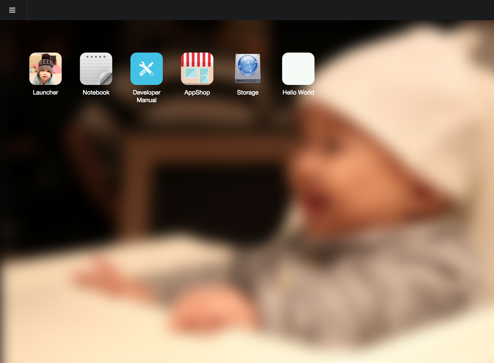

# *wife.io* #

`WifeOS` is an ongoing project of building a web OS for smart home, smart factory, personal NAS...etc. `wife.io` is the frontend implementation of `Wife OS` based on Node.js. It contains a server to handle REST API requests from client apps and a bunch of internal apps including a default mobile-os-like `launcher` app as the portal of the system.



## Quick Start ##

1. `$ git clone https://github.com/knych/wife.io.git`
2. `$ cd wife.io`
3. `$ npm install`
4. [Choose a device](#user-content-device-support)
5. [Configure server settings](#user-content-wife-server-configuration)
6. `$ gulp`
7. `$ node mywife/index.js`
8. Go http://localhost:8001 and enjoy your wife

## Device Support ##

You can find the device support list:
```
$ gulp distclean
$ gulp
```
You should see a device support list like below:
```
Device Support List
------------------------------
 0: generic/common
 1: xilinx/zynq
------------------------------
```

If there is no customization or hot fix required for your device, `generic/common` is okay to run on your system.

Choose a device to build:
```
$ gulp generic/common
```


## Wife Server Configuration ##

Each of devices has its own server settings file (`server-settings.json`).
Modify the [settings](#user-content-server-settings) for your device if needed.

### Server Settings ###
```
web_protocol   : http | https
port           : port
user_data_path : Data disk mountpoint for storing user apps and user data
temp_data_path : Temp path for server runtime temporary files
portal         : The portal application
```


## Wife System Developer Guide ##

### Build Your Wife Using IDE (Sublime Text) ###

Refer to [Wife IDE Installation Guide](https://www.evernote.com/l/AMv_ZRQaZ0lEEKXZF28E_ojXFXSz_YWQz-s).

### Build Your Wife From Scratch ###

Refer to [Quick Start](#user-content-quick-start).

#### All Build Targets ####

Once device selection is done, press 'Alt + B' in Sublime Text will list all build targets.

```
server    : express server that provides system services via web api
device    : device specific system configuration and binaries
sdk       : software development kit for app developer
apps      : builtin apps
clean     : remove build
distclean : remove build and device selection
```

## Wife App Developer Guide ##

### Install Wife SDK ###

```
$ npm install -g wife-sdk
```

### Create A New App ###

Wife SDK provides a app creator tool for you to create an app skeleton.
Here is an example of creating a `Hello World` app:

```
$ wife-app-creator -f /usr/local/lib/node_modules/wife-sdk/bin/examples/hello_app.json .

Create application `Hello World`:
  Install SDK: Version 1
  Generate hello-world/css/AppMainStyle.css
  Generate hello-world/gulpfile.js
  Generate hello-world/img/icon.png
  Generate hello-world/index.html
  Generate hello-world/js/app.js
  Generate hello-world/js/views/AppMainView.jsx
  Generate hello-world/manifest.json
  Generate hello-world/package.json
Your application is created at `hello-world`.
```

As you can see from the output, the app is created in the `hello-world` folder.

Simply run `$ wife-app-creator` with no arguments to see detail usage:
```
Usage:
wife-app-creator -n {APP_NAME} -v {APP_VERSION} -a {API_VERSION} -t {APP_TYPE} -d {APP_DESC} OUTPUT_PATH
wife-app-creator -f {APP_CONF_FILE} OUTPUT_PATH
where:
   APP_NAME:      App name (Ex: 'Hello World')
   APP_VERSION:   App version in string (Ex: '1.0.0')
   API_VERSION:   API version number (Ex: 1)
   APP_TYPE:      App type ('Internal', 'User' or 'Certified')
   APP_DESC:      App description
   APP_CONF_FILE: App configuration file in JSON format (See 'sdk/bin/examples/hello_app.json' for example)
   OUTPUT_PATH:   App files output path
```

### Build Hello World App ###
```
$ cd hello-world
$ npm install
```
#### Build ####
```
$ gulp
```
The production of your app is under `build/{app_name}` folder.

#### Archive ####
```
$ gulp archive
```
The production app archive `{app_name}.zip` is created in `build/` folder.

#### Clean ####
```
$ gulp clean
```
This will remove `build` folder.
```
$ gulp distclean
```
This will remove both `build` and `node_modules` folders.

### Build Using IDE (Sublime Text) ###

The IDE build system can build standalone app with the same set of hotkeys:
```
Cmd/Ctrl+B : Build application
Alt+A : Build application archive
Alt+C : Clean build
Alt+D : Dist clean
```
