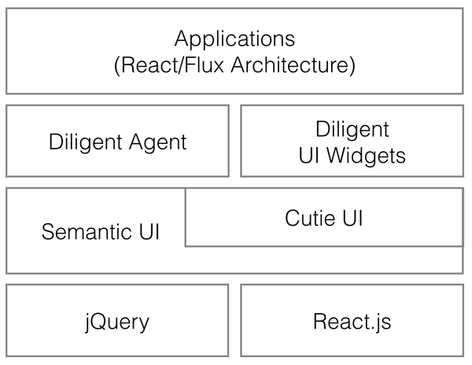
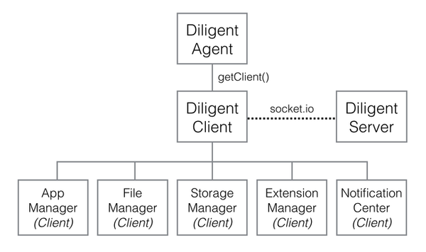
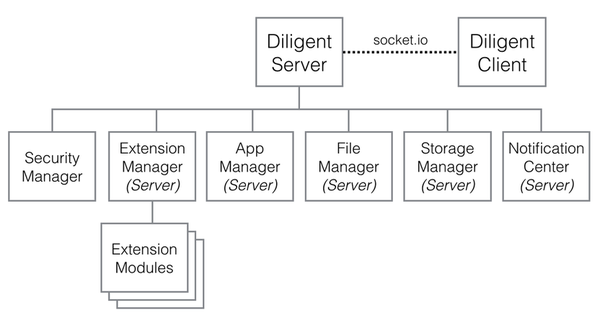

#wife.io

`wife.io` is an extensible web control system designed for devices which are capable of running node.js.

###Architecture

Frontend: Application Framework



Frontend: Diligent Agent (Client)



Backend: Diligent Server



###Diligent

`Diligent` is the core spirit of `wife.io`. It maintains socket.io connection between devices (server) and browser (client) and provides a common interface to access all functionalities supported by diligent server.

###Prepare
```
$ npm install
$ source envsetup.sh
```

###Build your wife
```
$ gulp
```
This will build and install your wife to `mywife/` folder.
```
$ gulp clean
```
Remove `mywife/` folder.


###Gulp build targets
```
server   : diligent server runs on node.js
lib      : 3rd-party libraries (jquery, react, semantic-ui...etc)
diligent : diligent client framework (diligent agent, diligent clients and diligent ui widgets)
cutie    : cutie ui framework
app      : builtin apps
api      : socket.io api spec
resource : copy resource files
config   : system configuration files
```

###Build individual apps
```
$ cd apps/yourapp
$ gulp
$ gulp clean
```
