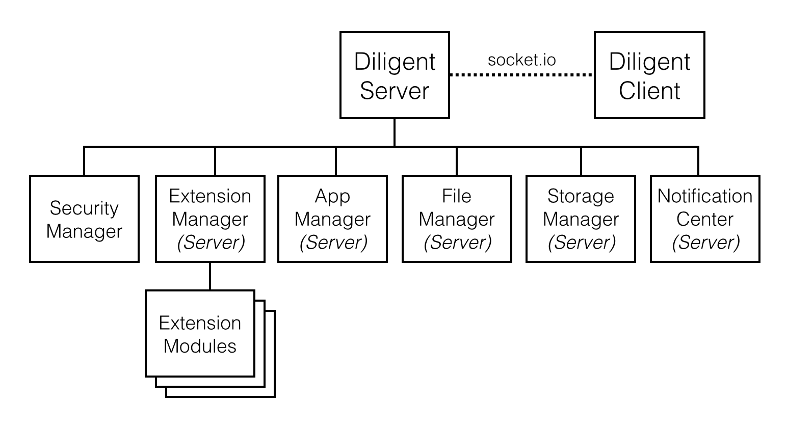

# *wife.io* #

`wife.io` is an extensible web operating system designed for devices which are providing specific services to a small group of users, such as SmartHome Controller, NAS, Media  Center in Car, Factory Management...etc.

## Quick Start ##

1. `npm install`
2. [Configure system settings](#user-content-wife-system-configuration)
2. `gulp`
3. `node mywife/index.js`
4. Go http://localhost:8001 and enjoy your wife


## Wife System Configuration ##

You should edit system configuration file (`settings.json`) for the system to run in your environment.

### System Settings ###
```
Protocol       : http | https
SystemDataPath : Data disk mountpoint for installing user apps and saving user data
TempPath       : Temp path for server runtime temporary files
```


## Wife System Developer Guide ##

### Architecture ###

#### Diligent Server (Backend) ####



#### Diligent Framework (Frontend) ####


#### Application Framework (Frontend) ####


### Diligent Framework ###

`Diligent Framework` is the core of `wife.io`. It helps you maintain the [Diligent Connection](#user-content-diligent-connection) between device-side (server) and browser-side (client). It also provides [Agents](#user-content-agents), [Clients](#user-content-client-library) and UI widgets to make your app getting access to server functionalities easier.

#### Client Library ####

Client library is consists of client objects which are responsible for maintaining socket.io connection and accessing server functionalities and services through the `Diligent APIs`.
Client APIs can be called by DiligentClient object returned from `DiligentAgent.getClient()`, but this is not recommended way to interact with server in an app. If you are a wife app developer, you should get familiar with [Agents](#user-content-agents).

#### Agents ####

Agents are global objects used by wife apps and delegated by client objects to handle API calls and events in a good way.

Agents wrap client APIs and dispatch client events to the agent mixins of React components of apps. This makes app developers easier to manage the state of components and makes app codes more elegant. Check out [Wife App Developer Guide - Working With Agents API](#user-content-working-with-agents-api) to find more.


#### Cutie UI ####

TBD

#### UI Widgets ####

TBD

### Diligent Connection ###

Establishing `Diligent Connection` between client and server is the key step in app launching process before fetching server data. [Wife App Life Cycle](#user-content-wife-app-life-cycle) describes how an app is launching.

This section is to take a look into Diligent Connection flow.

TBD

### Build Your Wife From IDE (Sublime Text 2) ###

Refer to [Wife IDE Installation Guide](https://www.evernote.com/l/AMv_ZRQaZ0lEEKXZF28E_ojXFXSz_YWQz-s)

### Build Your Wife From Scratch ###

#### Prepare ####
```
$ npm install
$ source envsetup.sh
```

#### Build Your Wife ####
```
$ gulp
```
This will build and install your wife to `mywife/` folder.
```
$ gulp clean
```
Remove `mywife/` folder.


#### All Build Targets ####
```
server   : diligent server runs on node.js
lib      : 3rd-party libraries (jquery, react, semantic-ui...etc)
diligent : diligent framework (agents, clients and ui widgets)
cutie    : cutie ui framework
app      : builtin apps
api      : socket.io api spec
resource : copy resource files
config   : system configuration files
```


## Wife App Developer Guide ##

### Install Wife SDK ###

```
$ TBD
```

### Create A New App ###

```
$ TBD
```

### Build Your App ###
```
$ cd yourapp
$ npm install
```
You may need to modify LIB_PATH in `gulpfile.js` to correct your wife.io library path
```
var LIB_PATH = '/your/path/to/wife.io/lib'
```
#### Build and archive ####
```
$ npm run-script build
$ npm run-script archive
```
The production source codes of your app is under `build/{app_name}` folder,
and your app archive for installer is `build/{app_name}.zip`.

#### Clean build ####
```
$ npm run-script clean
```

### Wife App Life Cycle ###


### Working With Agents API ###

#### Diligent Agent ####

Methods
```
getClient : get diligent client object
render    : render app main view with navigator, dock and console
```
Callbacks
```
diligentClientWillLaunch()
diligentClientDidLaunch()
diligentClientWillTerminate()
diligentClientDidTerminate()
diligentConnectionDidEstablish()
diligentConnectionDidClose()
diligentConnectionDidFail()
diligentApiDidLoad()
diligentApiLoadFail()
```

#### Extension Agent ####

Methods
```
load             : load extension
unload           : unload extension
getExtensionInfo : get extension info
```
Callbacks
```
extensionWillLoad(extensionName)
extensionWillUnload(extensionName)
extensionDidLoad(extensionName)
extensionDidUnload(extensionName)
extensionLoadFail(extensionName)
extensionUnloadFail(extensionName)
```

#### Storage Agent ####

Methods
```
list              : fire query storage list request
setDiskInUse      : set disk as current working disk
getDisks          : get storage list responsed from server
getDiskInUse      : get current working disk
isDiskInUse       : check if disk is working disk
getDiskByUUID     : get disk by uuid
getDiskAddLast    : get most recent added removable disk
getDiskRemoveLast : get most recent removed removable disk
getDiskError      : get most recent disk error
```
Callbacks
```
storageDidReceiveList
storageDidMount
storageDidUnmount
storageWillSetInUse
storageDidSetInUse
storageSetInUseFail
storageInUseDidChange
storageHasError
```
